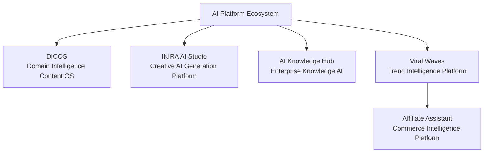

# Gbolahan Alabi

AI Systems Builder • AI Product Architect • AI Workflow Engineer

I design and build **AI-driven software systems** by combining product architecture thinking with **AI-assisted development workflows**.

My focus is building **structured AI platforms that operate reliably in real-world environments**.

---

# AI Platform Ecosystem

The systems below represent an ecosystem of AI platforms I am building.
Each platform explores a different layer of AI-powered product architecture.

These platforms demonstrate how AI systems combine **data pipelines, orchestration layers, and domain-aware AI generation** to create production-ready software platforms.

The systems below are documented through **code-first architecture audits**, where working repositories are analyzed and converted into system-level architecture documentation.

---

# What I Build

I specialize in designing systems that combine:

* AI models
* orchestration pipelines
* structured domain knowledge
* scalable SaaS architecture

The goal is to build **AI platforms that can move from experimentation to production environments**.

---

# Featured AI Systems

## DICOS — Domain Intelligence Content Operating System

A multi-tenant SaaS platform for generating **domain-aware, policy-constrained content across multiple channels**.

Key ideas:

* Domain Intelligence Packs (DIPs)
* AI orchestration pipelines
* compliance-aware generation systems
* multi-tenant SaaS architecture
* asynchronous processing infrastructure

Architecture documentation:

https://github.com/gboalabi/ai-product-builder/tree/main/projects/dicos

---

## IKIRA AI Studio

An AI creation platform designed to support **multi-model content generation pipelines**.

Focus areas:

* image generation pipelines
* video generation orchestration
* AI model routing systems
* modular AI tool integrations
* AI-assisted creative workflows

Architecture documentation:

https://github.com/gboalabi/ai-product-builder/tree/main/projects/ikira-ai-studio

---

## AI Knowledge Hub

A platform for building **domain-specific AI knowledge systems** that allow organizations to interact with their documents and data through AI.

Key capabilities:

* document ingestion pipelines
* vector search infrastructure
* retrieval-augmented generation
* domain-aware knowledge systems
* AI-powered knowledge interfaces

Architecture documentation:

https://github.com/gboalabi/ai-product-builder/tree/main/projects/ai-knowledge-hub

---

## Viral Waves

A trend intelligence platform designed to detect **early social momentum signals** and convert them into actionable campaign strategies.

Focus areas:

* trend signal ingestion and scoring pipelines
* velocity and acceleration analysis
* AI-assisted creative strategy generation
* campaign planning workflows
* alert-based signal monitoring

Architecture documentation:

https://github.com/gboalabi/ai-product-builder/tree/main/projects/viral-waves

---

## Affiliate Assistant

A creator-commerce platform designed to support **AI-assisted monetization workflows for digital creators and affiliates**.

Focus areas:

* affiliate offer aggregation
* creator storefront infrastructure
* AI-assisted product discovery
* campaign optimization workflows
* event-driven monetization systems

Architecture documentation:

https://github.com/gboalabi/ai-product-builder/tree/main/projects/affiliate-assistant

---

# Development Approach

I build systems using **AI-assisted engineering workflows**, combining architectural design with tools that accelerate implementation.

Key areas of focus:

* AI system architecture
* AI orchestration pipelines
* SaaS platform design
* AI-assisted development workflows

---

# Portfolio

AI Product Builder Portfolio

https://github.com/gboalabi/ai-product-builder

---

# Contact

GitHub:
https://github.com/gboalabi
